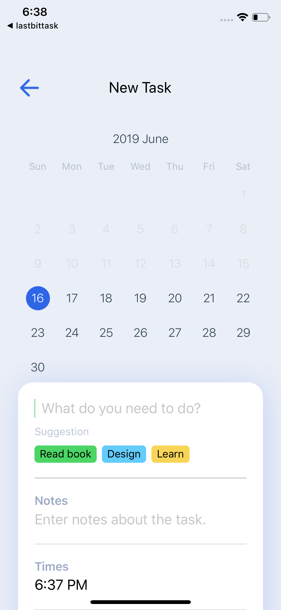
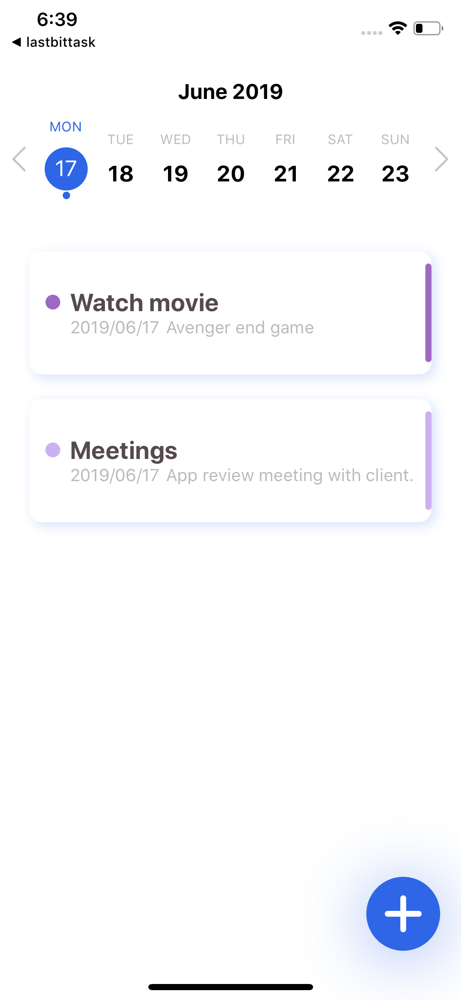

## Calender Event App

This app will save your calender event in your native iOS and android calender.

- build using [expo](https://expo.io).

## Getting Started

### Installation

```
npm install
```

## Video

<div align="center">
 
</div>

### Screenshots

<p align="center">
  
  
  
  
  
</p>
